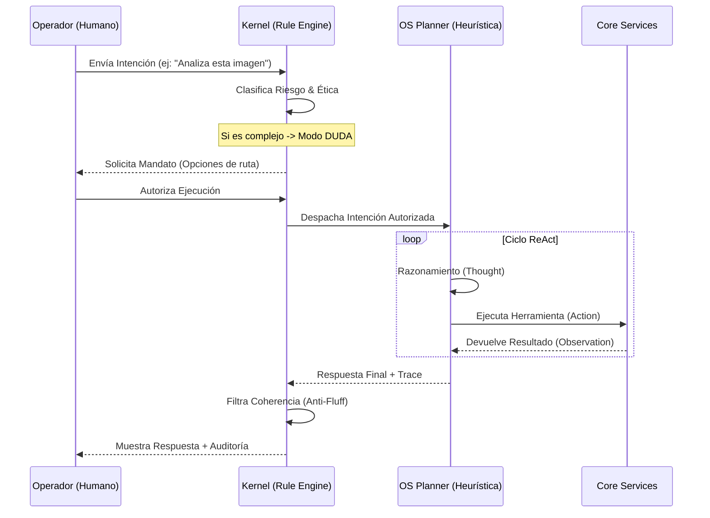

# 🧠 Arquitectura de ALEGR-IA OS v2.0
## Sistema Operativo de Coherencia Creativa y Soberanía Humana

ALEGR-IA OS no es solo una interfaz de chat; es una arquitectura desacoplada diseñada para garantizar la **soberanía del operador** y la **transparencia cognitiva** de la IA. El sistema se divide en tres capas fundamentales.

---

## 🏗️ 1. Capas del Sistema

### A. Capa Core (El Motor)
Es el paquete agnóstico de ejecución. No toma decisiones, solo ejecuta capacidades.
- **Anima**: Servicio de comunicación con LLMs (Groq, Gemini, OpenAI). Maneja la "cascada de inteligencia".
- **Nexus**: El "Sistema Central de Archivos" y Memoria. Gestiona la persistencia léxica y los logs de decisión.
- **Radar**: Sensores de contexto. Realiza búsquedas externas y escaneos de tendencias (Sondas).
- **Lexicon**: Repositorio de observaciones y patrones de identidad de marca.

### B. Capa OS (La Inteligencia Operativa)
Actúa como el sistema de conducción autónoma que orquesta al Core.
- **Rule Engine (Kernel)**: El cerebro ético. Evalúa intenciones usando el protocolo **ACSP**. Decide si una acción es `authorized` (segura), `rejected` (bloqueada) o `doubt` (requiere mandato humano).
- **OS Planner (ReAct Executor)**: Un agente de razonamiento que utiliza el ciclo *Thought -> Action -> Observation*.
- **Action Registry**: Catálogo de herramientas que el OS puede usar (Búsqueda, Memoria, Guardado de Archivos, Análisis Visual).

### C. Capa Frontend (La Consola de Operador)
Interfaz premium construida en React + Vite + Tailwind.
- **AnimaUI**: Consola principal con **Raw Inspector**. Muestra en tiempo real el razonamiento del sistema y las alertas de "humo" léxico.
- **Launcher Modules**: `Genesis`, `VEOscope` y `BrandScanner`. Interfaces especializadas que preparan intenciones complejas.

---

## 🔄 2. El Ciclo de Soberanía (ACSP)

El Alegría Coherence & Sovereignty Protocol (ACSP) es el flujo que garantiza que ninguna IA actúe sin supervisión en áreas críticas.

---

## 🛠️ 3. Componentes Clave de Datos

### 📁 Gestión de Archivos y Visión
- **Upload Endpoint**: Localizado en `/api/storage/upload`. Centraliza archivos para análisis multimodal.
- **OS_Analyze_Visual**: Herramienta que mapea archivos locales hacia modelos Vision (Llama 3.2 Vision) para extraer metadatos creativos.

### 🚬 Auditoría de "Humo" (Smoke Analysis)
El Kernel analiza la salida del LLM antes de mostrarla, detectando tres tipos de anomalías:
1.  **Emotional**: Lenguaje meloso o servil que intenta manipular la percepción del usuario.
2.  **Authority**: Afirmaciones de verdad absoluta sin base factual de Radar.
3.  **Meta**: Auto-referencias innecesarias del modelo ("Como IA...", "Mi programación...").

---

## 🚀 4. Stack Tecnológico

| Componente | Tecnología |
| :--- | :--- |
| **Backend** | Python 3.10+ / FastAPI |
| **Frontend** | React 18 / Vite / TypeScript |
| **AI Cascada** | Groq (Llama 3.3/3.2), Gemini 2.0, OpenAI |
| **Database** | JSON Persistente (Nexus) / Lexical Store |
| **Protocolo** | ACSP (Arquitectura Propietaria) |

---

## 📜 5. Principio de la Constitución ALEGR-IA
> "El operador es la única fuente de lógica; el sistema es el ejecutor de esa voluntad. El sistema no ayuda, el sistema opera."
