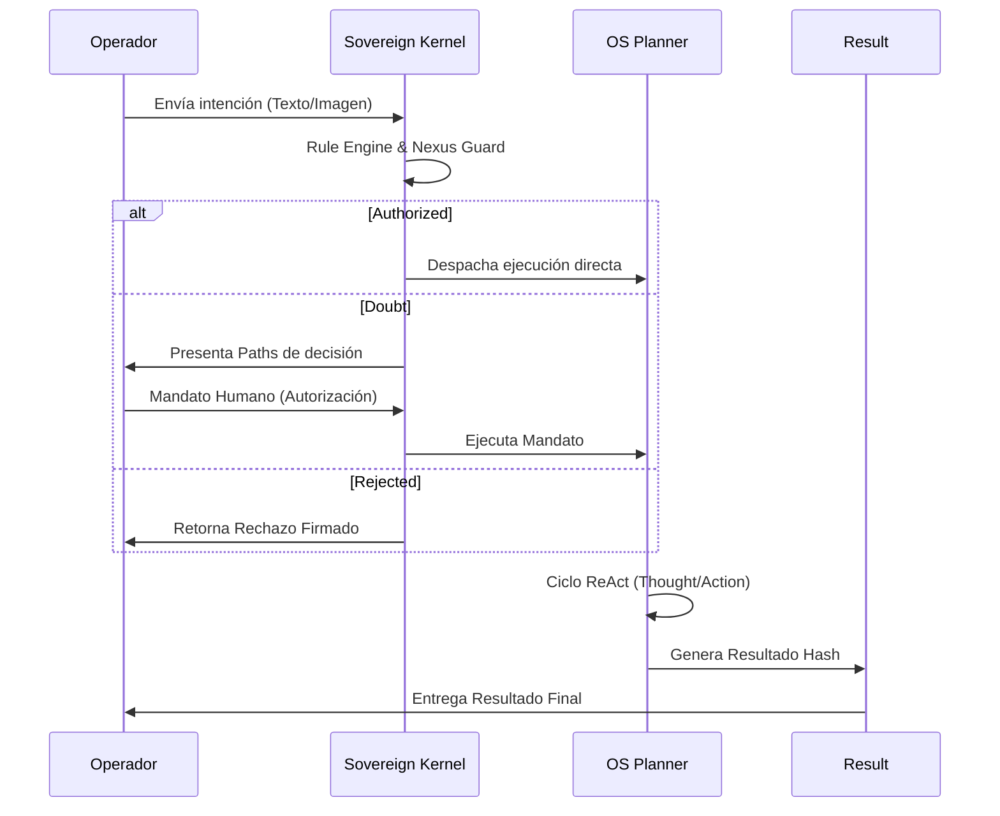

# 🛰️ ALEGR-IA OS — INFRAESTRUCTURA v5

## Estado Arquitectónico Consolidado · Abril 2026

> **"Sovereignty by Design, Intelligence by Intent."**
> Protocolo ACSP 4.0 activo. El operador humano es la única fuente de mandatos ejecutivos.

---

## 📋 ÍNDICE

1. [Árbol del Proyecto](#arbol)
2. [Stack Tecnológico](#stack)
3. [Capas del Sistema](#capas)
4. [Mapa de Módulos Backend](#backend)
5. [Mapa de Módulos Frontend](#frontend)
6. [API Surface (Rutas Registradas)](#api)
7. [Ciclo ACSP 4.0](#acsp)
8. [Estado de Nodos (Ghost Node Pattern)](#nodos)
9. [Bugs Conocidos & Deuda Técnica](#bugs)
10. [Hoja de Ruta Activa](#roadmap)
11. [Reglas No-Negociables](#reglas)

---

## 🌳 1. Árbol del Proyecto {#arbol}

```text
ALEGRIA_OS/
├── backend/
│   ├── main.py                         # Entry point alternativo
│   ├── requirements.txt
│   ├── provider_config.json            # Config de proveedores LLM
│   ├── dev.db                          # SQLite (Prisma ORM)
│   ├── prisma/                         # Schema de base de datos
│   ├── storage/                        # Archivos subidos por el operador
│   ├── logs/                           # Trazas de ejecución
│   ├── data/                           # Datos persistentes del OS
│   └── src/
│       ├── server.py                   # ⭐ Servidor FastAPI principal
│       ├── alegria_sdk/                # Constitución ACSP (SDK propietario)
│       ├── core/
│       │   ├── kernel.py               # Soberano Kernel (orquestador)
│       │   ├── rule_engine.py          # Motor de reglas éticas (26 KB)
│       │   ├── modality_router.py      # Router de modalidad texto/visual
│       │   ├── action_schema.py        # Esquema de acciones
│       │   └── handlers/              # Manejadores de estado
│       ├── os/
│       │   ├── orchestrator.py         # OS Planner (ReAct Executor)
│       │   ├── handlers.py
│       │   ├── actions/                # Catálogo de herramientas OS
│       │   ├── cognition/              # Ciclos de razonamiento
│       │   ├── creative/               # Pipeline creativo
│       │   ├── lexicon/                # Repositorio léxico
│       │   ├── perception/             # Percepción multimodal
│       │   ├── pipeline/               # Orquestación de pasos
│       │   └── radar/                  # Sondas de investigación
│       ├── services/
│       │   ├── anima_service.py        # Servicio principal de LLM (10 KB)
│       │   ├── anima_builder.py        # Constructor de prompts
│       │   ├── anima_guardian.py       # Filtro ético de salida
│       │   ├── nexus.py                # Memoria soberana (18 KB)
│       │   ├── provider_registry.py    # Registro de proveedores LLM (26 KB)
│       │   ├── provider_cascade.py     # Cascada de failover
│       │   ├── brand_service.py        # Gestión de marcas
│       │   ├── developer.py            # Generación de código (19 KB)
│       │   ├── radar.py                # Búsqueda web externa
│       │   ├── search_module.py        # Motor de búsqueda
│       │   ├── veoscanner.py           # Análisis visual (8 KB)
│       │   ├── news_service.py         # Servicio de noticias (RSS)
│       │   ├── news_sensor.py          # Sensor de noticias en tiempo real
│       │   ├── ethical_guard.py        # Guardia ética (9 KB)
│       │   ├── rejection_service.py    # Servicio de rechazos ACSP
│       │   ├── connector_registry.py   # Registro de conectores (14 KB)
│       │   ├── memoria_fundacional.py  # Memoria base del sistema
│       │   ├── query_classifier.py     # Clasificador de consultas
│       │   ├── web_navigator.py        # Navegación web (Playwright)
│       │   ├── web_reader.py           # Lectura de páginas
│       │   ├── world_gateway.py        # Gateway al mundo exterior
│       │   ├── database.py             # Conexión DB
│       │   ├── dependency_manager.py   # Gestión de dependencias
│       │   └── llm_adapters/           # Adaptadores por proveedor LLM
│       ├── routes/
│       │   ├── anima.py                # /anima (27 KB — ruta principal)
│       │   ├── routes_anima.py         # /anima (versión extendida)
│       │   ├── nexus.py                # /nexus
│       │   ├── radar.py                # /radar
│       │   ├── storage.py              # /storage
│       │   ├── developer.py            # /developer
│       │   ├── brand.py                # /brand
│       │   ├── veoscope.py             # /veoscope (8 KB)
│       │   ├── connectors.py           # /connectors
│       │   ├── providers.py            # /providers
│       │   ├── noticias.py             # /noticias
│       │   └── rejection_routes.py     # Rutas de rechazo ACSP
│       ├── perception/
│       │   ├── radar/                  # Percepción Radar
│       │   └── veoscope/               # Percepción visual
│       ├── agents/                     # Agentes autónomos
│       ├── domain/                     # Modelos de dominio
│       ├── infrastructure/             # Infraestructura base
│       ├── integrations/               # Integraciones externas
│       ├── modules/
│       │   └── presence_engine/        # Motor de presencia
│       └── utils/                      # Utilidades compartidas
│
├── frontend/
│   ├── index.html
│   ├── vite.config.js                  # Vite + proxy /api → :8000
│   ├── tailwind.config.js
│   └── src/
│       ├── App.jsx                     # ⭐ Orquestador visual (610 líneas)
│       ├── main.jsx
│       ├── index.css / App.css
│       ├── manifest.json               # PWA manifest
│       ├── sw.js                       # Service Worker
│       ├── anima/
│       │   └── AnimaUI.tsx             # Consola principal del operador
│       ├── components/
│       │   ├── SidebarComp.jsx         # Navegación lateral
│       │   ├── SystemState.jsx         # Indicador de estado ACSP
│       │   ├── DynamicWorkspace.jsx
│       │   ├── HighEndDeveloperUI.jsx
│       │   ├── VideoAIHubUI.jsx
│       │   ├── TallerUI.jsx
│       │   ├── AnimaForgeUI.jsx
│       │   ├── NoticiasUI.jsx          # Dashboard de noticias (RSS)
│       │   ├── CRMUI.jsx
│       │   ├── AppAgentUI.jsx
│       │   ├── MarketplaceUI.jsx
│       │   ├── APIInstallerUI.jsx
│       │   ├── NexusUI.jsx
│       │   ├── ExternalToolsPanel.jsx  # WebViews externas
│       │   ├── ChatModuleMobile.jsx    # Chat circular móvil
│       │   ├── AlegrIAIcon.jsx         # Ícono Anima Chordata
│       │   └── sidebarCategories.js    # Definición de módulos
│       ├── genesis/
│       │   └── GenesisUI.jsx           # Splash inicial / diagnóstico
│       ├── brand/
│       │   ├── BrandScannerUI.jsx
│       │   └── BrandStudioUI.jsx
│       ├── content/
│       │   └── ContentMachineUI.tsx    # Máquina de contenido (14 KB)
│       ├── radar/
│       │   └── RadarDashboard.jsx      # Dashboard de investigación
│       ├── veoscanner/
│       │   └── VEOscopeUI.jsx          # Análisis visual
│       ├── nexus/
│       │   └── NexusPrimeUI.jsx        # Memoria soberana UI
│       ├── mando/
│       │   └── MandoUI.jsx             # Centro de mando
│       ├── lexicon/
│       │   └── LexiconPanel.jsx        # Panel léxico lateral
│       ├── developer/                  # Entorno de desarrollo
│       ├── blocks/                     # Componentes reutilizables
│       ├── system/
│       │   └── SettingsUI.jsx
│       ├── core/
│       │   └── initializeRegistry.js   # Init del registro de módulos
│       ├── utils/
│       │   └── messageAdapter.ts       # Adaptador respuesta backend↔UI
│       └── styles/                     # Tokens de diseño
│
├── alegria_sdk/                        # SDK raíz (copia de referencia)
├── docs/
│   └── INTERFACE_TECHNICAL_SPEC.md
├── INFRAESTRUCTURA_v5.md               # ← Este documento
├── ALEGRIA_OS_ARCHITECTURE.md          # Arquitectura narrativa
├── ARCHITECTURE.md                     # Arquitectura v2.0
├── HANDOVER_COLABORATIVO.md            # Handover para agentes IA
├── DEFINICIONES_OFICIALES.md
├── PROMPT_ENGINEERING_STANDARD.md
├── README.md / README_UI.md
└── START_ALEGRIA.bat                   # Lanzador del sistema
```

---

## ⚙️ 2. Stack Tecnológico {#stack}

| Capa | Tecnología | Versión | Notas |
| :--- | :--- | :--- | :--- |
| **Backend Runtime** | Python | 3.10+ | `.venv` en `/backend/venv` |
| **Backend Framework** | FastAPI + Uvicorn | Latest | ASGI, auto-reload |
| **ORM / DB** | Prisma + SQLite | — | `dev.db` en `/backend` |
| **Frontend Framework** | React | 18+ | |
| **Frontend Build** | Vite | Latest | Puerto 5173 |
| **Typing Frontend** | TypeScript | — | Componentes críticos |
| **Estilos** | TailwindCSS + Vanilla CSS | — | Dark mode, glassmorphism |
| **Iconos** | Lucide React | — | |
| **LLM Proveedor 1** | Groq (Llama 3.3 / 3.2 Vision) | — | Velocidad + visión |
| **LLM Proveedor 2** | Google Gemini 2.0 | — | Razonamiento complejo |
| **LLM Proveedor 3** | OpenAI GPT-4o | — | Músculo creativo |
| **LLM Local** | Ollama | — | Soberanía local offline |
| **Protocolo Proxy** | Vite `/api` → `localhost:8000` | — | Configurado en `vite.config.js` |
| **WebSockets** | FastAPI WS | — | Tiempo real (Noticias) |
| **Visión Web** | Playwright | — | `web_navigator.py` |

---

## 🏗️ 3. Capas del Sistema {#capas}

```mermaid
graph TD
    subgraph Frontend [FRONTEND React/Vite]
        A[App.jsx] --> B[Módulos lazy]
        B --> C[AnimaUI / GenesisUI / Radar...]
    end

    C -- "fetch /api/* (Vite Proxy)" --> Server

    subgraph Backend [BACKEND FastAPI server.py]
        Server[FastAPI Server]
        Server --> Routes
        Server --> Core
        Server --> Services
        Server --> OS

        subgraph Routes
            R1[/anima]
            R2[/nexus]
            R3[/radar]
            R4[/storage]
        end

        subgraph Core
            C1[Kernel]
            C2[RuleEngine]
            C3[ModalityRouter]
        end

        subgraph Services
            S1[Nexus Mem]
            S2[Anima LLM]
            S3[Veoscanner]
        end

        subgraph OS
            O1[Orchestrator]
            O2[ReAct Executor]
        end
    end

    Services --> L1[Groq API]
    Services --> L2[Gemini API]
    Services --> L3[Ollama Local]
```

### A. Capa de Rutas (Routes)

Despacha peticiones HTTP entrantes. Cada router está registrado con **aislamiento de fallos** — si un módulo falla al importar, el sistema continúa en modo degradado.

### B. Capa Core (Kernel + Rule Engine)

- **`kernel.py`**: Punto de control soberano. Aplica el protocolo ACSP sobre cada intención.
- **`rule_engine.py`**: Evalúa el riesgo ético de cada acción (`authorized` / `rejected` / `doubt`).
- **`modality_router.py`**: Detecta si el input es texto puro o incluye datos visuales y enruta en consecuencia.

### C. Capa de Servicios (Services)

Capacidades puras sin estado de protocolo. Acceden a LLMs, web, memoria y archivos.

### D. Capa OS (Orchestrator)

El `orchestrator.py` implementa un ciclo **ReAct** (Thought → Action → Observation). Es el ejecutor de pipelines complejos una vez que el Kernel autoriza.

### E. Capa de Percepción (Perception)

Preprocessing de inputs multimodales: `radar/` para búsqueda web, `veoscope/` para análisis visual con Llama 3.2 Vision.

---

## 🔌 4. API Surface — Rutas Registradas {#api}

| Prefijo | Archivo | Función Principal |
| :--- | :--- | :--- |
| `GET /` | server.py | Health check del sistema |
| `GET /status` | server.py | Estado de todos los nodos cargados |
| `/anima/*` | routes/anima.py | Chat, execute, proactive, pipeline |
| `/nexus/*` | routes/nexus.py | Memoria soberana CRUD |
| `/radar/*` | routes/radar.py | Búsqueda web externa |
| `/storage/*` | routes/storage.py | Upload/download de archivos |
| `/developer/*` | routes/developer.py | Generación de código |
| `/brand/*` | routes/brand.py | CRUD de marcas |
| `/veoscope/*` | routes/veoscope.py | Análisis visual |
| `/connectors/*` | routes/connectors.py | Conectores externos |
| `/providers/*` | routes/providers.py | Config de proveedores LLM |
| `/noticias/*` | routes/noticias.py | Feed RSS + noticias real-time |

### Endpoints clave en `/anima`

```text
POST /anima/chat          → Paso 1 ACSP: Detección de intención
POST /anima/execute       → Paso 2 ACSP: Ejecución del mandato autorizado
POST /anima/proactive     → Saludo proactivo al abrir módulo
GET  /anima/trace/{id}    → Auditoría de traza de ejecución
```

---

## 🔄 5. Ciclo ACSP 4.0 {#acsp}



### Estados del sistema (ACSP State Machine)

| Estado | Significado | UI Signal |
| :--- | :--- | :--- |
| `idle` | Sin actividad | Verde estático |
| `thinking` | Kernel procesando intención | Azul pulsante |
| `doubt` | Esperando mandato del operador | Ámbar |
| `executing` | Pipeline activo | Púrpura animado |
| `error` | Fallo controlado | Rojo |

---

## 👻 6. Ghost Node Pattern {#nodos}

El servidor implementa carga resiliente con el patrón **GhostNode**: si un servicio falla al inicializar, se reemplaza por un nodo fantasma que responde `{status: "degraded"}` en lugar de crashear el sistema.

```python
# Cada servicio cargado con aislamiento de fallo:
nexus            = loader.load_node("nexus", "src.services.nexus")
provider_registry = loader.load_node("provider_registry", "src.services.provider_registry")
radar            = loader.load_node("radar", "src.services.radar")
anima            = loader.load_node("anima", "src.services.anima")
developer        = loader.load_node("developer", "src.services.developer")
brand            = loader.load_node("brand", "src.services.brand_service")
connector_registry = loader.load_node("connector_registry", "src.services.connector_registry", "ConnectorRegistry")
```

**Verificar estado:** `GET /status` retorna estado vivo/ghost de cada nodo.

---

## 🚨 7. Bugs Conocidos & Deuda Técnica {#bugs}

### A. Críticos (Bloquean funcionalidad)

| ID | Módulo | Descripción | Estado |
| :--- | :--- | :--- | :--- |
| BUG-01 | `/brand/all` | Error 500 por serialización JSON malformada en `BrandService` | ⚠️ Parcialmente corregido |
| BUG-02 | `ContentMachineUI` | No maneja estados vacíos con gracia cuando la API falla | ⚠️ Pendiente |
| BUG-03 | Backend `.venv` | Dependencias rotas en Windows | ✅ Resuelto |
| BUG-04 | `/storage` | Endpoint bloqueaba inicialización del servidor | ✅ Resuelto |

### B. Medios (Degradan experiencia)

| ID | Módulo | Descripción |
| :--- | :--- | :--- |
| BUG-05 | `AnimaUI` | El Audit Log no se visualiza en tiempo real |
| BUG-06 | Noticias | Routing 404 en algunos casos de proxy |
| BUG-07 | `App.jsx` | Body overflow en modo Master-Detail |
| BUG-08 | `alert_level` | Señal no conectada visualmente |

### C. Menores

| ID | Descripción |
| :--- | :--- |
| BUG-09 | CORS configurado con `"*"` |
| BUG-10 | Versión de `server.py` desactualizada |

---

## 🗺️ 8. Hoja de Ruta Activa {#roadmap}

### [A] ModalityRouter + Veoscanner Pipeline ⬜

- **Meta**: Diferenciación orgánica de inputs visuales vs texto
- **Archivos**: `core/modality_router.py`, `services/veoscanner.py`
- **Criterio de éxito**: Imagen pasa por Veoscanner ANTES del LLM cascade

### [B] Audit Log en tiempo real (AnimaUI) ⬜

- **Meta**: Eliminar la "caja negra" del pipeline de ejecución
- **Archivos**: `AnimaUI.tsx`, `routes/anima.py`
- **Criterio de éxito**: El operador ve pasos Lexicon → Nexus → Radar en árbol visual

### [C] ContentMachine + Brand Resilience ⬜

- **Meta**: Manejo gracioso de estados vacíos y errores de API
- **Archivos**: `ContentMachineUI.tsx`, `services/brand_service.py`
- **Criterio de éxito**: UI muestra estado "Doubt" premium, nunca crashea

### [D] alert_level Integration ⬜

- **Meta**: Señales de riesgo del `RuleEngine` visibles en la UI
- **Archivos**: `core/rule_engine.py`, `utils/messageAdapter.ts`
- **Criterio de éxito**: Mensajes marcados visualmente como `Rejected`

### [E] Noticias Module Estabilización ✅ (parcial)

- **Meta**: Dashboard RSS/Weather en tiempo real integrado
- **Archivos**: `NoticiasUI.jsx`, `services/news_service.py`
- **Criterio de éxito**: Header soberano activo, sin 404 en proxy

---

## 📜 9. Reglas No-Negociables {#reglas}

> Estas reglas son constitucionales. No tienen excepción.

1. **La IA propone, el operador dicta.** Ningún componente debe auto-ejecutarse sin un click manual del operador.

2. **UI-Friendly Absoluto**: Si un servicio backend falla, la UI asume que el "bloque" está inactivo — jamás crashea.

3. **Estética Dark Premium**: Glassmorphism, Lucide Icons, animaciones suaves, paleta oscura HSL.

4. **Patrón de Clonado UI**: Al modificar un componente, crea versión provisoria e integra atómicamente.

5. **No toques el `.venv` global**: Solo modifica dependencias si es estrictamente necesario.

6. **Protocolo de Soberanía Criptográfica**: Cada mandato ejecutado debe generar y validar un `intention_id`.

7. **Sin URLs bare en Markdown**: Siempre usar formato `[texto](url)`.

8. **Server.py es el punto de entrada canónico**: Ejecutar desde la raíz del backend.

---

## 🖥️ 10. Infraestructura Crítica Windows {#windows-infra}

> [!IMPORTANT]
> **MANDAMIENTO-01: El Bloqueo de Scripts**
> Nunca debuggear código en Windows sin verificar la `ExecutionPolicy`. Si algo de Node, Prisma o scripts (.ps1) falla silenciosamente, el problema es casi siempre una restricción de permisos del sistema.

### Regla Operativa de Rescate
Antes de analizar código o logs complejos, ejecutar el bypass de permisos:
```powershell
Set-ExecutionPolicy -Scope Process -ExecutionPolicy Bypass
```

### Versión Permanente (Recomendada)
Para evitar bloqueos constantes en el entorno de desarrollo:
```powershell
Set-ExecutionPolicy -Scope CurrentUser -ExecutionPolicy RemoteSigned
```

---

## 🚀 11. Cómo Arrancar el Sistema


### Backend

```powershell
# Desde /backend
.\.venv\Scripts\Activate.ps1
python src/server.py
# → http://localhost:8000
```

### Frontend

```powershell
# Desde /frontend
npm run dev
# → http://localhost:5173
```

### Verificación rápida

```powershell
# Health check
Invoke-RestMethod http://localhost:8000/

# Estado de nodos
Invoke-RestMethod http://localhost:8000/status
```

---

*Documento generado automáticamente · ALEGR-IA OS Infraestructura v5 · Abril 2026*
*Firma del Operador Principal — Sovereignty by Design, Intelligence by Intent.*
